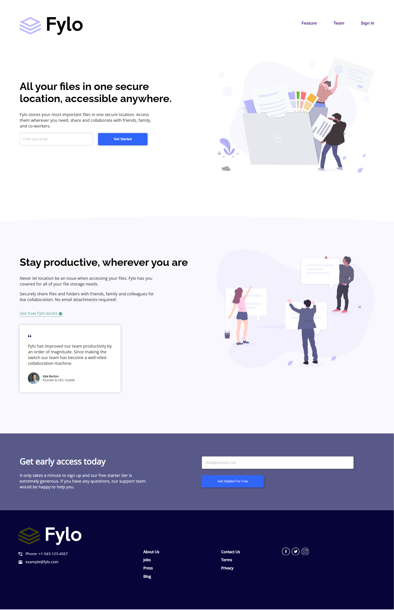

# Frontend Mentor - Fylo landing page with two column layout solution

This is a solution to the [Fylo landing page with two column layout challenge on Frontend Mentor](https://www.frontendmentor.io/challenges/fylo-landing-page-with-two-column-layout-5ca5ef041e82137ec91a50f5). Frontend Mentor challenges help you improve your coding skills by building realistic projects. 

## Table of contents

- [Overview](https://www.frontendmentor.io/challenges/fylo-landing-page-with-two-column-layout-5ca5ef041e82137ec91a50f5)
  - [The challenge](https://www.frontendmentor.io/challenges/fylo-landing-page-with-two-column-layout-5ca5ef041e82137ec91a50f5)
  - [Links](https://github.com/Abubakar-Tamboli/Fylo-landing-page)
  - [Author](https://github.com/Abubakar-Tamboli)

## Overview

### The challenge

Users should be able to:

- View the optimal layout for the site depending on their device's screen size
- See hover states for all interactive elements on the page

### Screenshot

### Links

- Solution URL: (https://github.com/Abubakar-Tamboli/Fylo-landing-page)
- Live Site URL: (https://abubakar-tamboli.github.io/Fylo-landing-page/)

## My process

### Built with

- Semantic HTML5 markup
- CSS custom properties
- Flexbox

## Author

- Website - [Abubakar Tamboli](https://github.com/Abubakar-Tamboli)
- Frontend Mentor - [@Abubakar-Tamboli](https://www.frontendmentor.io/profile/Abubakar-Tamboli)

